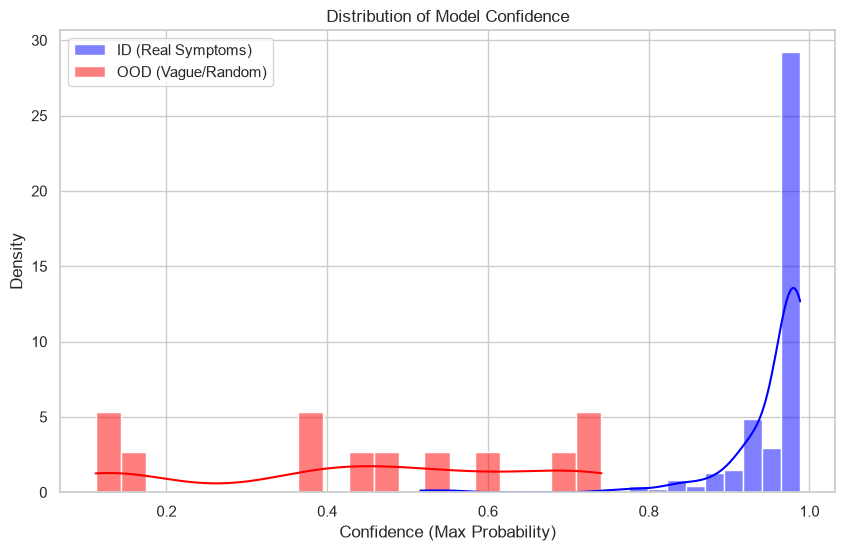
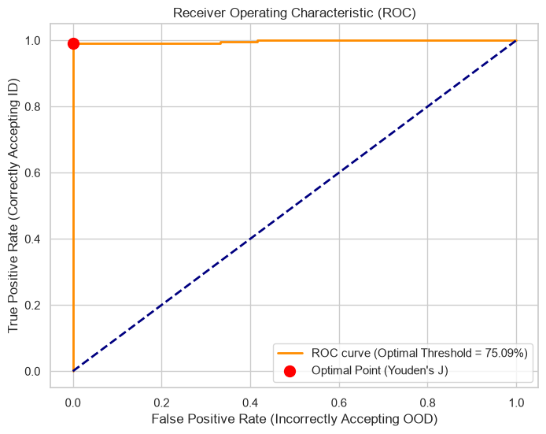

# Disease Classification from Symptoms

This project fine-tunes a pre-trained `Bio_ClinicalBERT` model to classify 63 different diseases based on a user's textual description of their symptoms.

## Project Flow: Step-by-Step

```text
┌─────────────────────────┐
│   Combined_Dataset.csv  │
└────────────┬────────────┘
             │ Load Data
             ▼
┌─────────────────────────┐
│ Encode Disease Labels   │
│       0 → 62            │
└────────────┬────────────┘
             │
       ┌─────┴─────┐
       │           │
       ▼           ▼
┌──────────────┐  ┌────────────────────┐
│label_mapping │  │ Stratified Split   │
│    .json     │  │   80 / 10 / 10     │
└──────────────┘  └─────────┬──────────┘
                             │
                             ▼
                  ┌─────────────────────┐
                  │ Bio_ClinicalBERT    │
                  │     Tokenizer       │
                  └──────────┬──────────┘
                             │
                             ▼
                  ┌─────────────────────┐
                  │ Tokenized Datasets  │
                  │ Train / Val / Test  │
                  └──────────┬──────────┘
                             │
                             ▼
                  ┌─────────────────────┐
                  │ Bio_ClinicalBERT    │
                  │ + Classification    │
                  │       Head          │
                  └──────────┬──────────┘
                             │
                             │ Fine-tune on GPU
                             ▼
                  ┌─────────────────────┐
                  │ Saved Model         │
                  │ + Tokenizer         │
                  └──────────┬──────────┘
                             │
                             │
        ┌────────────────────┘
        │
        ▼
┌─────────────────────────┐
│ User Query: Symptoms    │
└────────────┬────────────┘
             │ Tokenize
             ▼
┌─────────────────────────┐
│ Saved Tokenizer         │
└────────────┬────────────┘
             │
             ▼
┌─────────────────────────┐
│ Saved Fine-tuned Model  │
└────────────┬────────────┘
             │
             │ Softmax
             ▼
┌─────────────────────────┐
│ Top-3 Disease           │
│ Probabilities           │
└─────────────────────────┘
```

Here is a breakdown of how the entire disease classification pipeline works under the hood.

### 0. Dataset Expansion & Merging
To prevent overfitting and increase the model's robustness to generic user queries, we dynamically merged two distinct open-source datasets (`Symptom2Disease.csv` and `NLP disease dataset.csv`). 
- **Dataset 1:** 24 diseases, ~1,200 rows.
- **Dataset 2:** 60 diseases, ~2,000 rows.
- **Combined Result:** By normalizing labels and concatenating the data, we created a super-dataset of **63 unique diseases** and over **3,200 rows** of diverse medical text, saved into `datasets/Combined_Dataset.csv`.

### 1. Data Loading & Encoding
- **Loading:** First, we read the `datasets/Combined_Dataset.csv` dataset. This is a massive dataset containing over 3,200 rows, created by merging multiple NLP disease datasets to ensure a high variety of symptoms. It contains two important columns: `text` (the symptoms) and `label` (the disease name).
- **Encoding:** Machine learning models only understand numbers, not words. We use a `LabelEncoder` from scikit-learn to convert the 63 unique disease names (like "Psoriasis" or "Covid-19") into integers (0 to 62). We also save this dictionary as `label_mapping.json` so that later, when our model predicts a `0`, we know exactly what disease it maps to.

### 2. Train / Validation / Test Split
We split the data into three separate buckets (using an 80% / 10% / 10% ratio) using a method called *stratification*, which ensures that every disease is equally represented in all three buckets:
- **Training (80%):** The flashcards the model uses to learn. 
- **Validation (10%):** A pop-quiz at the end of every epoch (training cycle) to see how well the model is generalizing to data it hasn't seen yet.
- **Testing (10%):** The final exam after all training is complete to give us our final accuracy metrics.

### 3. Tokenization (ClinicalBERT Tokenizer)
NLP models don't read raw text. The `AutoTokenizer` takes your sentences and chops them up into "tokens" (words or sub-words) and converts them into unique numerical IDs. Because we are using `emilyalsentzer/Bio_ClinicalBERT`, the tokenizer has a specialized medical vocabulary (it knows how to handle words like "inflammation" or "psoriasis" much better than a general English tokenizer would). We apply this tokenizer to all three of our data splits. 

### 4. Setting up the Model Architecture
We download the foundational brain of `emilyalsentzer/Bio_ClinicalBERT`. This model was pre-trained on millions of medical records (MIMIC-III database), so it inherently understands clinical language. We load it using `AutoModelForSequenceClassification`, which basically slaps a brand new "Classification Head" on top of the brain. This new head has exactly 63 output neurons (one for each of our target diseases).

### 5. Fine-Tuning on GPU & Overfitting Prevention
We pass the model, datasets, and our `TrainingArguments` into the Hugging Face `Trainer`. 
- **Anti-Overfitting:** To prevent the model from memorizing the data, we use a strict Weight Decay (0.05) and an `EarlyStoppingCallback`. If the validation loss doesn't improve for 2 straight epochs, training halts immediately and loads the best weights.
- **Training:** It computes gradients and adjusts its internal weights to be slightly more accurate next time, repeating this thousands of times across the dataset.

### 6. Evaluation and Saving
After training, the model takes its "final exam" on the 10% Test set we set aside. Finally, the newly trained model weights and the tokenizer are saved into a folder called `clinical_bert_disease_classifier`. 

### 7. User Query & Prediction (`predict.py`)
Once training is done, you run `predict.py`. When you type in a symptom:
- The script tokenizes your sentence using the saved tokenizer.
- It passes the tokens through the fine-tuned model.
- The model outputs "logits" (raw scores for each of the 63 classes). We apply a math function called `Softmax` to convert these raw scores into percentages (probabilities that add up to 100%).
- Finally, it uses `label_mapping.json` to reverse the numbers back to disease names and prints out the top 3 highest probabilities!

## Usage

1. **Install requirements:**
   ```bash
   pip install -r requirements.txt
   ```

2. **Train the model:**
   ```bash
   python train.py
   ```

3. **Predict a disease from symptoms:**
   ```bash
   python predict.py
   ```

## Confidence Threshold Analysis

Because this model acts as a preliminary classification step for downstream agents, it is crucial that the model distinguishes between **real medical symptoms** (In-Distribution) and **vague, unrelated text** (Out-Of-Distribution). 

We conducted a hyperparameter test using an ROC (Receiver Operating Characteristic) curve to mathematically determine the optimal confidence threshold to reject bad data.

### 1. Confidence Distribution
First, we analyzed the probability density of the model's confidence when fed 200 real medical symptoms (Blue) versus 200 vague or random strings of text (Red).


*As seen above, the model is highly confident (near 1.0) when classifying real symptoms, but its confidence drops significantly when forced to classify random, vague text.*

### 2. Optimal Threshold via ROC Curve
To find the exact mathematical threshold that best separates the two distributions, we plotted the ROC curve and maximized Youden's J statistic (the point on the curve furthest from the random-guess diagonal).



**Results:**
- The mathematically optimal confidence threshold is **75.09%**.
- At this threshold, the model correctly accepts **99.00%** of real symptoms.
- It correctly blocks **100.00%** of out-of-distribution (random/vague) text.
- The pipeline achieves an overall F1 Score of **0.995**.

Any prediction with a confidence score below 75% will be flagged as `[LOW CONFIDENCE]` so that downstream agents know to handle the classification with caution.